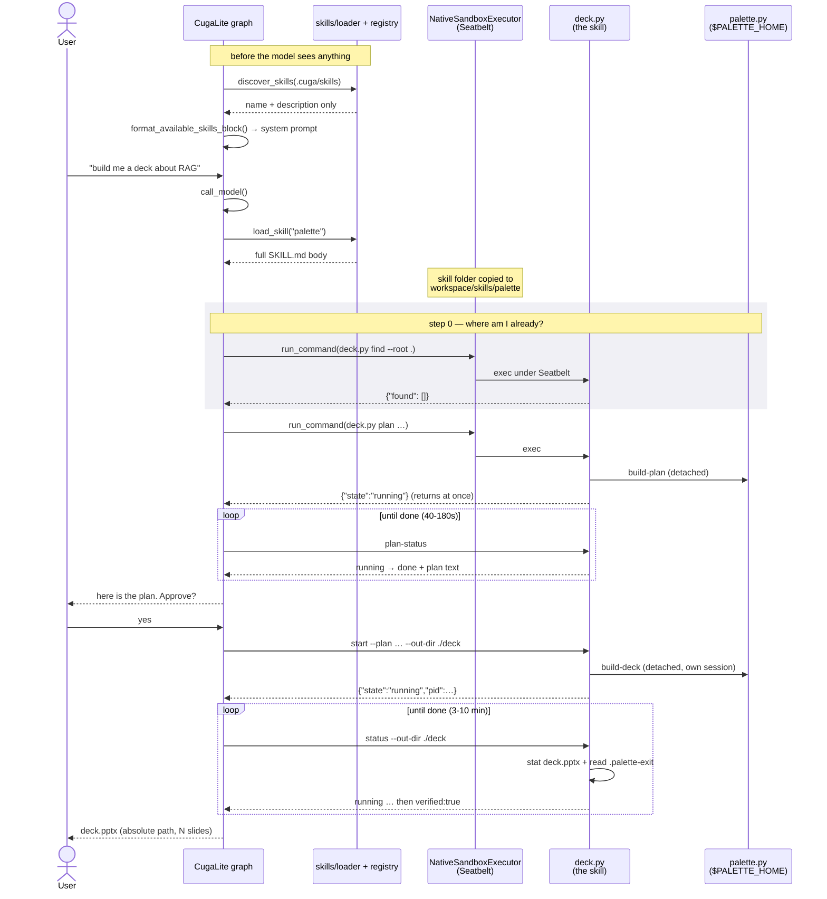

# Understanding the skill flow in CUGA

How *"build me a deck about RAG"* becomes a `.pptx`, at the level of which
component does what. File and function names are real; signatures are not
reproduced, because those drift and the shape does not.

Two repos are involved and the split matters:

- **CUGA** routes, sandboxes, and executes. It knows nothing about decks.
- **Palette** owns the skill and the pipeline. It knows nothing about CUGA.

The only contract between them is a folder — `skills/palette/` — copied into
`.cuga/skills/`, plus two environment variables.

---

## The whole path



---

## Stage by stage

### 1. Discovery — before the model sees anything

`prepare_node.py` builds the system prompt for every turn. When
`[skills] enabled` is on it calls `discover_skills(cuga_folder)`, which walks
`.cuga/skills/**/SKILL.md`, parses the YAML frontmatter, and **strips Jinja
delimiters** (`{{ }}`, ``) from the values — a SKILL.md is untrusted input
being interpolated into a prompt template, so this closes a prompt-injection
route.

`format_available_skills_block()` then emits **only the name and description**:

```
<available_skills>
- **palette**: Create, revise, and render slide decks (PowerPoint .pptx) …
</available_skills>
```

> **Why this matters to the skill author.** The description is the *entire*
> routing decision. The 200-line body is not in the prompt yet and cannot
> influence whether the skill is chosen. Write the description as the phrases
> a user actually says.

### 2. Routing — the model chooses

The model sees the block and calls `load_skill("palette")`.
`SkillRegistry.load_skill` returns the **full SKILL.md body**, wrapped in
CUGA's own guidance: where companion files live
(`/workspace/skills/palette`), a playbook, and command-normalisation notes.

Only now does the agent know how to build a deck.

### 3. Materialisation — the skill's files land in the sandbox

The sandbox executor copies the skill folder into the per-thread workspace at
`workspace/skills/palette/`, so `scripts/deck.py` is a real file the agent can
execute. Two consequences worth knowing:

- The agent runs the **copy**, not your working tree. Editing `SKILL.md` in
  Palette changes nothing until you reinstall — `make verify` exists to catch
  exactly this.
- The skill folder must be self-contained. Anything it needs at runtime has to
  be in the folder, or reachable through `$PALETTE_HOME`.

### 4. Execution — `run_command` inside Seatbelt

`build_runtime_tools()` injects a `run_command` tool bound to a sandbox
executor. On macOS that is `NativeSandboxExecutor`, which wraps every command
in `sandbox-exec` with a generated policy:

| Policy | Effect on the skill |
|---|---|
| `(allow file-read*)` | can read the Palette checkout |
| writes confined to `/private/tmp` + the workspace | output must land in `--out-dir` |
| `(allow process*)`, `(allow network-outbound)` | can spawn `palette.py`, can reach the models |
| `(allow signal (target self))` | **cannot signal another process** |

That last line is not a footnote. It is why `deck.py` never asks the kernel
whether a build is alive, and instead waits for a file — see *Completion*
below.

Each command is capped at `advanced_features.sandbox_execution_timeout`
(30s default; the `demo_palette` preset raises it to 120s).

### 5. The skill's own layer — `deck.py`

`deck.py` is the only thing the agent runs. It exists because two things are
awkward at the boundary:

**Working directory.** `palette.py` imports its pipeline by relative import, so
it only runs with the checkout as cwd — but output has to land in the agent's
workspace. `deck.py` resolves paths to absolute, then runs `palette.py` with
`cwd=$PALETTE_HOME`. Neither the agent nor you ever holds both roots.

**Duration.** Drafting a plan is 40-180s; a deck is 3-10 minutes. Both can
outlive a step. So every slow command detaches:

```
sh -c '<palette.py …> ; echo $? > .palette-exit'   # start_new_session=True
```

The command returns in milliseconds. The work continues in its own session,
and the exit code lands in a file when it ends.

### 6. Completion — computed, never claimed

This is the part that took the most iterations to get right, and every
iteration came from a real failure.

`status` answers in this order:

1. **Has it ended?** `.palette-exit` exists → yes. Otherwise, if liveness is
   *undeterminable* (the sandbox refusing to discuss another process), treat it
   as still running. Undetermined must never read as dead.
2. **Is there a real deck?** `stat` `deck.pptx`; `verified` is true only if it
   exists and is large enough not to be a stub.

Both conditions, in that order. Reasons:

- Palette **re-renders the same path** two or three times while repairing
  geometry, so a complete-looking `.pptx` appears minutes before the build is
  over. Checking the file alone hands over a pre-repair deck.
- `os.kill(pid, 0)` raises `PermissionError` under Seatbelt. Reading that as
  "the process died" failed every sandboxed build on its first poll.

The agent never decides whether a deck exists. It relays a computed flag.

### 7. Resumption — because the agent forgets

An agent does not reliably remember earlier turns; the user does. Left with
only "how to start a deck", it restarts at the confirmation gate every turn,
asks again, and never polls the build it already launched. Observed for 33
minutes with a finished deck on disk.

So the workflow opens with **step 0**: `deck.py find --root .` reports every
plan and every build beneath the workspace, and the agent branches on that
rather than on memory.

---

## Where each concern lives

| Concern | Owned by | Why there |
|---|---|---|
| Should this skill run at all? | SKILL.md `description` | it is the whole routing signal |
| How to build a deck | SKILL.md body | ships with Palette, one copy |
| Which directory to run from | `deck.py` | the agent should not hold two roots |
| Surviving a step limit | `deck.py` | detach + poll |
| Is the deck real? | `deck.py verify()` | a fact, not a judgement |
| How long a step may run | CUGA preset | host-specific; Claude Code differs |
| Where files land | CUGA workspace | per-thread, `cuga_workspace/<id>/` |
| The rendering pipeline | `palette.py` | the skill only drives its CLI |

The dividing line throughout: **SKILL.md holds judgement, `deck.py` holds
facts.** Anything a model could get wrong in its own favour is computed.

---

## Reading it yourself

| Step | Start here |
|---|---|
| discovery, prompt block | `cuga/backend/skills/loader.py`, `skills/tools.py` |
| routing, `load_skill` | `cuga/backend/skills/registry.py` |
| prompt assembly | `cuga_graph/nodes/cuga_lite/adapter/prepare_node.py` |
| tool injection | `cuga_graph/nodes/cuga_agent_core/tools/runtime_tools.py` |
| sandbox policy | `cuga_lite/executors/native/native_sandbox_executor.py` |
| the skill's layer | `skills/palette/scripts/deck.py` (Palette) |
| preset settings | `cuga/cli/main.py` → `_apply_palette_env` |

See also [`../CHEATSHEET.md`](../CHEATSHEET.md) for testing this from a clean
slate, and [`skill-guide.html`](skill-guide.html) for the same story told for
someone trying it rather than reading it.
