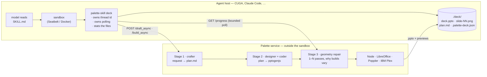

# The Palette skill

What it is, what the build produces, and how to get from an empty machine to an
agent that builds you a deck.

> In a hurry? [CHEATSHEET.md](CHEATSHEET.md) is this page condensed to one
> screen: reset levels, the build/install loop, and the checks that tell you a
> deck is real.
>
> Before any clean-up command, `git status --short` and commit. The clean-room
> reset drops `.venv`, `node_modules` and `dist/`, and `git clean -fd` would take
> anything still untracked with it.

---

## 1. What a skill is

A skill is a folder an agent can open when a task matches it. Not a plugin, not
an API integration — a **markdown file with a description**, plus whatever files
the workflow needs.

The mechanism is the same on every host that supports them:

1. At startup the host scans a skills directory and reads each `SKILL.md`'s
   frontmatter. Only the one-line `description` goes into the model's prompt.
2. When a task matches that description, the model asks for the skill by name.
3. The host hands back the **full markdown body**, which becomes the model's
   instructions for that task.
4. Companion files land where the agent can reach them.

The economics are the point. A description costs ~60 tokens on every turn; the
body costs nothing until it is needed. You can ship twenty capabilities without
paying for twenty playbooks on every message.

**The description is the whole routing decision.** If it does not contain the
words a user would actually say, the skill is never opened, however good the
body is.

## 2. What *this* skill is

Palette is a deck builder: a FastAPI service wrapping a three-stage model
pipeline, plus Node, LibreOffice, Poppler and IBM Plex. None of that can live
inside an agent sandbox.

So the skill is **not** a copy of Palette. It is:

- **instructions** for driving Palette's HTTP API, and
- **a thin client** (`httpx` and nothing else) that ships with them.

The agent installs the client, calls the service, and gets back a `.pptx`. The
heavy machinery stays on the server, where it already works.



Three things that diagram is trying to make obvious:

- **The sandbox boundary is why the skill exists.** Node, LibreOffice, Poppler
  and the model roster cannot live inside an agent sandbox, so the skill ships
  instructions and a thin client rather than a copy of Palette.
- **`deck` sits on the sandbox side and owns the session.** Thread id, plan
  file, polling and download are all its business, which is what stops an agent
  losing a build halfway through.
- **Stage 3 is why "how long" has no fixed answer.** The repair loop runs as
  many passes as the slides need, so the same request is three minutes on one
  run and ten on the next.

The only coupling is the HTTP contract. Palette's pipeline can be rewritten
without the skill noticing.

## 3. The parts

| File | Role |
|---|---|
| `contract.py` | Every endpoint, written once. The client, the docs and the tests all read this. |
| `client.py` | `PaletteClient` — the API surface, including bounded polling. |
| `cli.py` | `palette-skill`, one JSON object per command. |
| `hosts.py` | Host profiles. The only host-specific part of the whole skill. |
| `service.py` | Host-side supervisor: start/stop/health/doctor for a local Palette. |
| `server_entry.py` | `palette-serve` — runs the server in the foreground. |
| `build_skill.py` | Renders the generated regions of the payload. |
| `install.py` | Installs, checks for drift, uninstalls. |
| `release.py` | Builds the shippable wheel and per-host tarballs. |
| `payload/SKILL.md` | What the agent is actually told. |
| `payload/reference.md` | Signatures and error types, loaded on demand. |

## 4. What each command produces

### `make skill-build` → `palette_skill/payload/`

Rewrites five fenced regions inside the two markdown files. Everything outside
the fences is hand-written and never touched.

| Region | Rendered from | Why it is generated |
|---|---|---|
| `execution` | `hosts.py` | Tool names and step limits differ per host |
| `endpoints` | `contract.py` | The API table, with CLI and Python for each route |
| `defaults` | `contract.py` | Base URL, auth env var, terminal stages |
| `models` | `config.py` | The three model menus the server will actually accept |
| `examples` | `config.py` | Curated plans, intersected with what is on disk |

Nothing else changes. It writes no code and touches nothing outside `payload/`.

### `make skill-check` → nothing, an exit code

Re-renders in memory and compares. Exit 1 if a region is stale, meaning
Palette's code moved and the skill did not.

### `make skill-test` → nothing, an exit code

**The full suite.** Walks `app.py`'s routes and request models, `config.py`'s
rosters, and the payload, asserting the skill still describes this server. Also
checks the client declares no runtime dependency beyond `httpx`, since that
wheel ships into every agent sandbox.

### `make skill` → both of the above

The one to run after every Palette change. About a second.

### `make skill-install CUGA=<path>` → an installed directory

Regenerates, builds a wheel, and writes:

```
<agent>/.cuga/skills/palette/
├── SKILL.md                                    what the agent is told
├── reference.md                                loaded on demand
├── vendor/palette_skill-0.1.0-py3-none-any.whl the client, httpx-only
└── .palette-skill.json                         host, version, commit, per-file hashes
```

The wheel is what lets the agent install the client offline — no git access, no
registry auth. The manifest is how `skill-status` knows which side moved.

`--host claude-code` renders a different `execution` region (`Bash` instead of
`run_command`, no step-limit guidance) and installs to `~/.claude/skills/palette`.

### `make skill-status CUGA=<path>` → a drift report

Compares the installed copy, the current sources and the current payload, and
names whichever moved. Re-renders for the host recorded in the manifest, then
restores the payload, so checking one host never disturbs another.

### `make skill-uninstall` / `clean-state` / `distclean`

Removal, in three sizes. `skill-uninstall` refuses any directory without our
manifest, so a mistyped `--skills-root` cannot delete your data. **None of them
touch `~/.config/palette/env`**, which holds your RITS key — `PURGE_CONFIG=1` is
the explicit opt-out and it backs the file up first.

---

## 5. Getting it running

The commands live in one place — [CHEATSHEET.md](CHEATSHEET.md) — so that when
one changes there is a single line to edit rather than five. §0 there is the
whole loop in six lines; §1 covers the reset levels, §2–6 build, release,
install, run and verify.

What is worth knowing *before* you follow it:

- **`make install` first on a fresh checkout.** It creates `.venv` and installs
  the package, so the `palette-skill` command exists. `-r requirements.txt`
  alone installs the dependencies and not the package, which fails later and
  confusingly.
- **The reset levels are not interchangeable.** Level 2 deletes
  `~/.local/state/palette`, and with it `server.log` — the only record of
  whether a build ever started. Do not wipe it while diagnosing a run.
- **`~/.config/palette/env` survives every level.** Your RITS key is the one
  thing on the machine that cannot be rebuilt from source, so no target removes
  it without `PURGE_CONFIG=1`, which backs it up first.
- **Verify from the filesystem, not the chat.** An agent can describe a deck it
  never built; that has happened. The three independent checks are in
  CHEATSHEET §6.

## 5b. When Palette is deployed elsewhere

If Palette already runs somewhere — Code Engine, a shared box, a colleague's
machine — the skill is unchanged. It is an HTTP client; only the URL differs.

**Skip entirely:** `serve init` / `doctor` / `ensure`, `npm install`,
LibreOffice, Poppler, Node, IBM Plex, and the RITS key. All of that belongs to
whoever runs the service. You do not need `.[server]` either.

**Two ways to point at it**, and the choice is about who owns the URL. Commands
for both are in [CHEATSHEET.md](CHEATSHEET.md) §4.

*Pin it into the skill* when a team shares one deployment. The generated
`defaults` region then reads *"Base URL — `https://palette.example.cloud`. This
skill was built for that deployment"*, and the URL is recorded in the manifest
so `--check` compares like with like. Every agent then works with no
environment set at all — which is the point: one fewer thing for each person to
get right.

*Set `$PALETTE_URL` at run time* when the URL varies by person or session. It
wins over a pinned URL either way, so pinning is a default rather than a
commitment.

**What the agent does when it cannot reach a remote deployment.** It reports the
URL and the error and asks you to confirm it — and specifically does *not*
suggest `palette-skill serve ensure`, because that would start a second, local
Palette with none of your data or models. The skill branches on whether the URL
is loopback, and a test pins that behaviour.

**What you still need the repo for.** The wheel is built from source at install
time, so installing the skill needs a Palette checkout even when the service is
remote. It does not need the server dependencies — `.[dev]` is enough. Making a
deployment serve its own matching skill would remove that last tie; it does not
exist yet.

---

## 5c. Shipping it to people who never clone Palette

```bash
make release                                     # dist/
make release BASE_URL=https://palette.example.cloud
```

Produces four artifacts:

| Artifact | For |
|---|---|
| `palette_skill-<v>-py3-none-any.whl` | PyPI, or a direct `pip install` |
| `palette-skill-<v>-cuga.tar.gz` | drop into a CUGA skills root |
| `palette-skill-<v>-claude-code.tar.gz` | drop into `~/.claude/skills/` |
| `palette-skill-<v>-generic.tar.gz` | any other host |

Each tarball is a complete skill folder — `SKILL.md`, `reference.md`, the client
wheel, and a manifest — rendered for that host. **~72 KB, no network, no build
step, no Palette source required.**

### Which skills root, and why it matters

Untarring into a skills root is the whole install — [CHEATSHEET.md](CHEATSHEET.md)
§4 has the command. The only real decision is *which* root:

```bash
tar xzf palette-skill-0.1.0-cuga.tar.gz -C .cuga/skills/      # CUGA's default
tar xzf palette-skill-0.1.0-cuga.tar.gz -C .agents/skills/    # the skills.sh root
```

`.agents/skills` with `[skills] root = "agents"` in CUGA's `settings.toml` puts
Palette alongside anything added with `npx skills add`, discovered the same way.

> CUGA scans **one** skills root. If you use `npx skills add ... -a universal`
> (which writes `.agents/skills/`) and also install Palette under
> `.cuga/skills/`, only one of the two is ever seen. Put them in the same root.

Or, from an index:

```bash
pip install palette-skill
python -m palette_skill.install --host cuga --skills-root .agents/skills
```

The wheel carries the payload as package data, so this needs no checkout
either. There is no vendored wheel in this mode, and the generated SKILL.md
adapts — it tells the agent `uv pip install palette-skill` rather than pointing
at a `vendor/` directory that would not exist.

### Pin the URL, or don't — what changes

`make release` and `make release BASE_URL=…` produce artifacts that differ in
two places, both generated:

| | unpinned | `BASE_URL=https://…` |
|---|---|---|
| Base URL | `$PALETTE_URL`, else `http://127.0.0.1:18814` | the pinned URL; `$PALETTE_URL` still overrides |
| If unreachable | branches: local → `serve` commands, remote → report and ask | report and ask only; **no local commands at all** |

The second row is the one that matters. A remote-pinned artifact deliberately
ships **no** `serve doctor` / `serve ensure` guidance, because following it
would start a *second, local* Palette with none of the user's data or models.
Pinning `127.0.0.1` still counts as local and keeps them.

So:

- **Deployed Palette** → `make release BASE_URL=https://…`. Consumers need no
  environment variable and no local install. Nothing to keep running.
- **Local Palette** → `make release` unpinned. Every consumer must have the
  service up before asking for a deck — `palette-skill serve ensure`, or
  `serve install` for a launchd agent that survives login. The skill tells them
  exactly that when a call fails.
- **Mixed** → ship unpinned and set `PALETTE_URL` per environment. It wins over
  a pinned URL either way.

### When to cut one at all

Two loops, and most changes only need the first.

| | Command | Needs a version? |
| --- | --- | --- |
| **Dev** — you and CUGA on one machine | `make skill-install CUGA=…` | no |
| **Ship** — anyone without a Palette checkout | `make release VERSION=X.Y.Z` | yes |

`skill-install` overwrites in place, and drift detection is hash-based
(`client_fingerprint` over the client sources, plus a hash per markdown file),
so the dev loop needs no version discipline at all. `make skill-status` tells
you which side moved.

A release is different because the version lands in every artifact's
*filename*. Ship twice as `0.1.0` and `dist/` overwrites silently, the
recipient cannot tell the two apart, and the manifest check that would catch it
— *"package version moved"* — can never fire, because both sides read `0.1.0`.
So `VERSION` also turns on a clean-tree requirement and a refusal to reuse.

**Does a given change even touch the skill?** `make skill` answers it in a
second, and the pre-commit hook runs it whenever `palette_skill/` is staged.
Roughly: `contract.py`, `client.py`, `cli.py`, `hosts.py` and `payload/` *are*
the skill; `app.py` routes and `config.py` rosters are what it describes; the
renderer and UI are behind the HTTP contract and usually invisible to it.

### A release is pinned to a Palette version

The model menus and example plans inside `SKILL.md` are rendered from the
checkout's `config.py` and then **frozen**. A skill advertising
`palette-qwen-32b` has to ship with a server that serves it, so the artifact
version tracks Palette rather than the client. Everything else — the execution
section, the endpoint table — is re-rendered per host at build time.

## 6. Day to day, once it works

```bash
make skill                                    # after every Palette change
make skill-install CUGA=../cuga-agent-july25  # ship it
make skill-status  CUGA=../cuga-agent-july25  # has either side moved?
```

The pre-commit hook runs the first of those automatically when you stage
`app.py`, `config.py`, `session.py`, `requirements.txt`, `pyproject.toml` or
`palette_skill/`.

[CHEATSHEET.md](CHEATSHEET.md) condenses all of the above to one page — reset
levels, the build/release/install loop, and the three checks that tell you a
deck is real.

See [TESTING.md](TESTING.md) for the full eight-tier verification ladder, and
[payload/SKILL.md](payload/SKILL.md) for what the agent is actually told.
